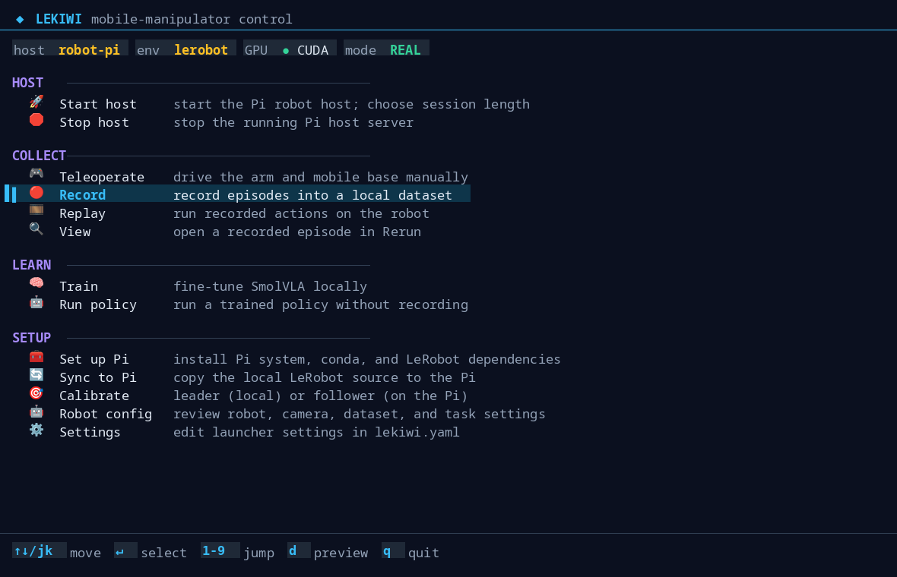
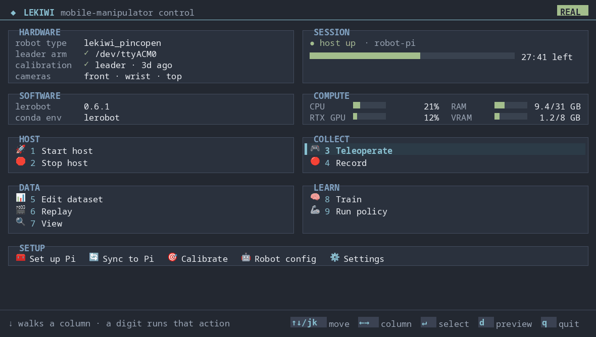
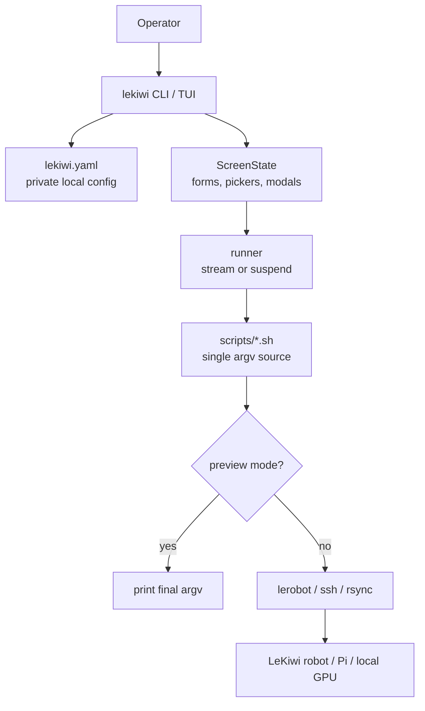

# LeKiwi TUI

A standalone immediate-mode TUI for the LeKiwi robot workflow. It runs real
`lerobot` commands through the local `scripts/*.sh` launchers and uses
`pyratatui` for the terminal UI. The first screen is the control panel: host,
env, GPU, and execution-mode status chips above the robot workflow actions.





## Features

- Start and stop the LeKiwi Pi host
- Teleoperate, record, replay, and view episodes
- Train and run SmolVLA policies
- Preview hardware commands before execution
- Edit robot, task, and launcher settings from the terminal

## Requirements

- Linux terminal environment
- Python 3.10+
- LeRobot installed in the active Python/conda environment
- A configured LeKiwi robot for real hardware actions

## Install

Create a private local config first:

```bash
cp lekiwi.example.yaml lekiwi.yaml
$EDITOR lekiwi.yaml
```

Install from this checkout inside the Python/conda environment that already has
`lerobot` installed:

```bash
python -m pip install -e .
```

The editable install is the supported install model. The CLI resolves this
checkout as the workspace root and runs the local launcher scripts from here.

If the checkout moves, reinstall it or set:

```bash
export LEKIWI_ROOT=/path/to/lekiwi-tui
```

## Run

Open the menu or jump straight to an action:

```bash
lekiwi                 # menu
lekiwi teleop          # direct action
lekiwi --dry-run       # preview commands
```

The shim still works and self-activates the configured conda env:

```bash
./lekiwi.sh
```

## Keys

- Move: arrows or `j`/`k`
- Adjust fields: left/right or `h`/`l`
- Edit/pick/start: Enter
- Back: `q`
- Help: `?`
- Toggle preview mode from the menu: `d`

## Config

- Publish `lekiwi.example.yaml`.
- Keep `lekiwi.yaml` private; it is ignored by Git.
- Launch env vars override `lekiwi.yaml`.
- `lekiwi.yaml` controls robot host/IP, serial ports, dataset paths, policy paths,
  cameras, and shared task text.

## Safety

Default mode is real execution. Use `--dry-run` or menu `d` to preview command
argvs before running hardware actions.

Remote SSH values are validated before use, and remote repo paths are quoted
before being embedded in remote shell commands. This prevents malformed config
from turning into surprising SSH behavior.

## How It Works



Python owns interaction and screen state. The launcher scripts own final
`lerobot`, `ssh`, and `rsync` command construction, so every action is also
inspectable from the shell with `--dry-run`.

## Development

```bash
python -m pip install -e .[dev]
python -m ruff check .
python -m pytest lekiwi_tui/tests
```

CI runs the same lean gate: editable install, import check, Ruff, and pytest.

## Launcher Scripts

The TUI fronts non-interactive shell launchers in `scripts/`. See
[scripts/README.md](scripts/README.md) for the launcher contract and standalone
dry-run examples.

## Acknowledgements

LeKiwi TUI builds on [LeRobot](https://github.com/huggingface/lerobot) and uses
[pyratatui](https://github.com/pyratatui/pyratatui) for the terminal UI.
