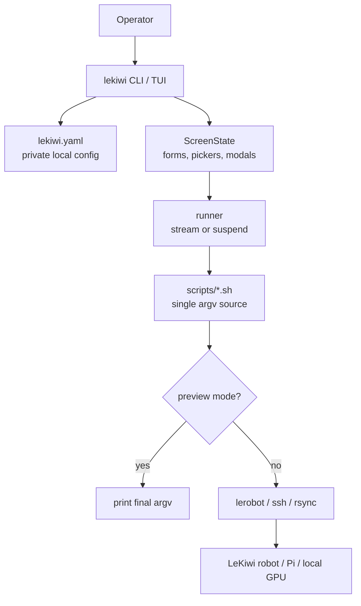

# LeKiwi TUI

One terminal for my whole LeKiwi workflow: start the host, teleoperate, record,
train, evaluate, keep the Pi in sync. Runs real `lerobot` commands through the
`scripts/*.sh` launchers, rendered with `pyratatui`.


## Features

- **Live status everywhere.** The robot chip shows host up/down and remaining
  session time on every screen.
- **One-terminal flow.** Start the host, hit `q`, it keeps running while you
  record or teleoperate. Come back and the live log re-attaches.
- **Record HUD.** Episode progress, loop-rate gauge, and a dataset panel
  (episodes, length, size, resume plan) before you commit.
- **Smart sync.** Mirrors the laptop checkouts to the Pi, re-installs only when
  dependencies changed, and prints exactly which version/branch ships.
- **Panic stop.** `K` twice from any screen kills the remote host.
- **Preview mode.** `d` flips every action to printing its argv instead of
  touching hardware.
- Teleoperate, record, replay, view, train, and run SmolVLA policies.

## Requirements

- Linux, Python 3.10+
- LeRobot in the active Python/conda environment
- The default robot type `lekiwi_pincopen` needs the
  [lerobot_robot_lekiwi_pincopen](https://github.com/zuoxingdong/lerobot_robot_lekiwi_pincopen)
  plugin on the Pi. Set up Pi / Sync to Pi install and ship it automatically.
  Driving a stock LeKiwi instead: set `ROBOT_TYPE` to `lekiwi` in Settings.
- Optional: `input` group membership enables base wasd keys in the record HUD
  view. The terminal view needs no system changes.

## Install

```bash
cp lekiwi.example.yaml lekiwi.yaml    # private local config, git-ignored
$EDITOR lekiwi.yaml
python -m pip install -e .            # in the env that has lerobot
```

Editable install is the supported model. If the checkout moves, reinstall or set
`LEKIWI_ROOT=/path/to/lekiwi-tui`.

## Run

```bash
lekiwi                 # menu
lekiwi teleop          # direct action
lekiwi --dry-run       # preview commands
```

`./lekiwi.sh` still works and self-activates the configured conda env.

## Keys

| Key | Action |
|---|---|
| arrows / `j` `k` | move |
| `1`-`8` | jump and run a menu action (setup rows have no shortcut) |
| left/right / `h` `l` | adjust fields |
| Enter | edit / pick / start |
| `q` | back (a running host stays up) |
| `d` | toggle preview mode (menu) |
| `K` `K` | emergency host stop, from any screen |
| `?` | help |

## Config

`lekiwi.yaml` (private, git-ignored) holds robot host/IP, serial ports, dataset
and policy paths, cameras, and the shared task text. Launch env vars override it.

## Safety

Default mode is real execution; preview it first with `--dry-run` or `d`.
Remote values are validated and quoted before they reach ssh. Host launches
abort rather than run with wrong cameras when the config ship fails.

## How It Works



Python owns interaction; the launcher scripts own the final `lerobot`/`ssh`/`rsync`
argv, so every action is inspectable from the shell with `--dry-run`. See
[scripts/README.md](scripts/README.md) for the launcher contract.

## Development

```bash
python -m pip install -e .[dev]
python -m ruff check .
python -m pytest lekiwi_tui/tests
```

CI runs the same gate.

## Related

- [lerobot_robot_lekiwi_pincopen](https://github.com/zuoxingdong/lerobot_robot_lekiwi_pincopen):
  the robot plugin this TUI drives by default
- [Mobile Manipulation with LeKiwi + PincOpen](https://huggingface.co/blog/zuoxingdong/mobile-manipulation-lekiwi-pincopen):
  the hardware story behind that robot

## Acknowledgements

Built on [LeRobot](https://github.com/huggingface/lerobot), rendered with
[pyratatui](https://github.com/pyratatui/pyratatui).
